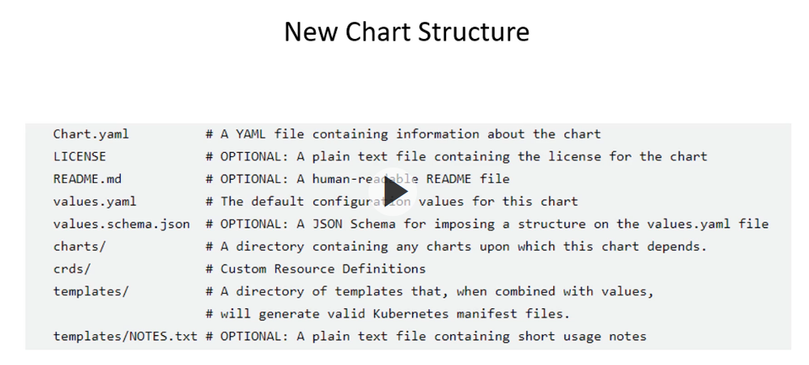

## Repository for getting started with Helm

If you are completely new to Helm and you would like to learn more, I highly suggest this [blog post]()

So what is Helm in the first place?

From the website
"Helm is the best way to find, share, and use software built for Kubernetes."

When you are using Kubernetes, you need to manage lots and lots of YAML manifests. These are usually presented in separate files. 

When it is just you deploying the Kubernetes resources needed for an application to run, it is ok to manage separate yaml manifests. However, once you are using multiple YAML manifests for your deployments, it will easily get difficult to install, manage and maintain those. 

## Installation

There are muultiple ways that you can install Helm. Have a look at their [website](https://helm.sh/) for all the different ways.

For example
```
brew install helm
```

Ensure that Helm is actually available on your machine:

```
helm version
```

Now, you can get started super easy just by running

```
mkdir charts

cd charts

helm create example-chart
```

This will create a basic Helm boiler template. Have a look at the presentation that walked through the different files that we have within that Helm chart.

**The Chart Structure**



Now before we actually install our Helm Chart, we want to make sure that it is all set-up properly

```
helm install --dry-run --debug example-chart ./example-chart
```

This will populate our templates with Kubernetes manifests and display those within the console. The benefit is that if you are already familiar with Kubernetes manifests, you will be able to cross-check the Kubernetes resource — and, if needed, make changes to your Kubernetes resources.

Once we are happy with what Helm will create, we can run:

```
helm install example-chart ./example-chart
```

Note that in this case, the name of my chart is "example-chart" you can name your chart however, you want to; just make sure that your are specifying the right path to your Helm chart.

Now we can have a look at the installed chart:

```
helm ls
```

And the history of events of our installed Chart:

```
helm history example-chart
```

If you are using Helm for your deployments, you want to store your Helm charts within a Helm repository. This will allow you to access your Helm charts over time. 

Once you have deployed a Helm Chart, you can also upgrade it with new values

```
helm upgrade [RELEASE] [CHART] [flags]
```

To remove our example chart:

```
helm delete example-chart
```

## Use the Helm Hub

Search for all helm repositories on the helm hub: [https://artifacthub.io/](https://artifacthub.io/)

```
helm search hub
```

Add a repositories

```
helm repo add <name> <repository link>
e.g. helm repo add bitnami https://charts.bitnami.com/bitnami
```

From [https://artifacthub.io/packages/helm/bitnami/mysql](https://artifacthub.io/packages/helm/bitnami/mysql)

List repositories all repositories that you have installed

```
helm repo list
```

Search within a repository

```
helm search repo <name>
```

Instead of using the commands, you can also search the chart repository online.

To upgrade the charts in your repositories

```jsx
helm repo update
```

Install a specific chart repository

```jsx
helm install stable/mysql --generate-name

```

Note that you can either ask Helm to generate a name with the —generate-name flag,

or you can provide the name that you want to give the chart by defining it after install

```
helm install say-my-name stable/mysql
```

Check the entities that got deployed within a specific cluster:

List all the charts that you have deployed with the following command

```
helm ls
```

To remove a chart use

```
helm uninstall <name of the chart>
```

## Discover new Charts

If you want to install a tool, I would always suggest you to Google for the Helm Chart. Every Helm Chart will have a values.yaml file. In the values.yaml file is a list of potential options that you can use to configure the Helm Chart. Usually, each option comes with additional explanations on how & why you would configure the Helm Chart in such a way.

